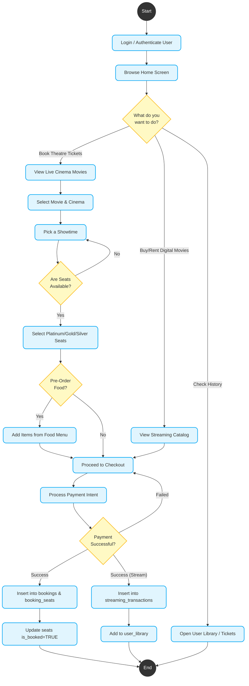

# BookMyMovie Activity Diagram

Based on analyzing the `database_schema.sql` file and the core features of your project, below is the formal **UML Activity Diagram** representing the primary dynamic workflow of the application: **The User Movie Booking & Management Flow**. 

This diagram captures the step-by-step actions, decision checks (diamonds), and parallel tracks that occur when a user interacts with the app.

## Activity Diagram (Flowchart)



## Detailed Flow Analysis
Because an Activity Diagram models the dynamic control flow from action to action, here is how the dependencies reflect the actual SQL tables working under the hood:
1. **Initial Split (`SelectAction`)**: User decides whether to interact with the local theatre system (`cinemas`, `showtimes`), or the digital OTT system (`streaming_catalog`).
2. **Decision Nodes (`CheckSeats` & `AddFood`)**: Checking seats reads whether `is_booked = FALSE` in the `seats` table. The optional branch allows users to aggregate prices from the `food_menu` table before checking out.
3. **Synchronization (Writing changes)**: Once the `Payment` decision node confirms success via Stripe/Wallet, the flow diverges based on what was bought:
   - For Theatre: The system runs parallel actions to simultaneously record the invoice in `bookings` and physically lock the `seats`. 
   - For Streaming: The system logs the receipt in `streaming_transactions` and vaults the movie access rights into `user_library`.

You can preview this file natively in your markdown reader or drop the ````mermaid```` block into Mermaid Live Editor to view the full graph shape!
