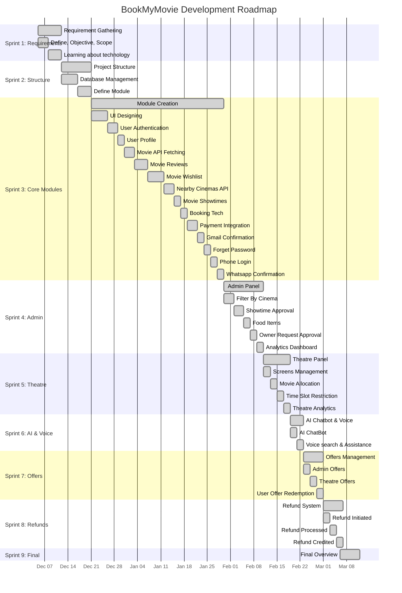

# 🗺️ Agile Process Plan & Roadmap

This document outlines the Agile development roadmap and schedule for the **BookMyMovie** project, detailing the sprints, tasks, and timelines.

---

## 📅 Roadmap Overview (Gantt Chart)

---

## 📊 Detailed Schedule Map

| Task Name | Duration | Start Date | Finish Date | Status |
| :--- | :---: | :---: | :---: | :---: |
| **Sprint #1: Requirement Gathering** | **7d** | **05-12-2025** | **11-12-2025** | ✅ Complete |
| └─ Define, Objective, Scope | 3d | 05-12-2025 | 07-12-2025 | ✅ Complete |
| └─ Learning about technology | 4d | 08-12-2025 | 11-12-2025 | ✅ Complete |
| **Sprint #2: Project Structure** | **9d** | **12-12-2025** | **20-12-2025** | ✅ Complete |
| └─ Database Management | 5d | 12-12-2025 | 16-12-2025 | ✅ Complete |
| └─ Define Module | 4d | 17-12-2025 | 20-12-2025 | ✅ Complete |
| **Sprint #3: Module Creation** | **40d** | **21-12-2025** | **29-01-2026** | ✅ Complete |
| └─ UI Designing | 5d | 21-12-2025 | 25-12-2025 | ✅ Complete |
| └─ User Authentication | 3d | 26-12-2025 | 28-12-2025 | ✅ Complete |
| └─ User Profile | 2d | 29-12-2025 | 30-12-2025 | ✅ Complete |
| └─ Movie Fetching Through API | 3d | 31-12-2025 | 02-01-2026 | ✅ Complete |
| └─ Movie User Reviews | 4d | 03-01-2026 | 06-01-2026 | ✅ Complete |
| └─ Movie Wishlist | 5d | 07-01-2026 | 11-01-2026 | ✅ Complete |
| └─ Fetching nearby Cinemas through API | 3d | 12-01-2026 | 14-01-2026 | ✅ Complete |
| └─ Movie Showtimes | 2d | 15-01-2026 | 16-01-2026 | ✅ Complete |
| └─ Booking Movie | 2d | 17-01-2026 | 18-01-2026 | ✅ Complete |
| └─ Payment Integration | 3d | 19-01-2026 | 21-01-2026 | ✅ Complete |
| └─ Booking Ticket Confirmation (Gmail) | 2d | 22-01-2026 | 23-01-2026 | ✅ Complete |
| └─ Forget Password (Gmail) | 2d | 24-01-2026 | 25-01-2026 | ✅ Complete |
| └─ Real-Time Login using Phone Number | 2d | 26-01-2026 | 27-01-2026 | ✅ Complete |
| └─ Booking Ticket Confirmation (Whatsapp)| 2d | 28-01-2026 | 29-01-2026 | ✅ Complete |
| **Sprint #4: Admin Panel** | **12d** | **30-01-2026** | **10-02-2026** | ✅ Complete |
| └─ Filter By Cinema | 3d | 30-01-2026 | 01-02-2026 | ✅ Complete |
| └─ Showtime Approval | 3d | 02-02-2026 | 04-02-2026 | ✅ Complete |
| └─ Adding Food items | 2d | 05-02-2026 | 06-02-2026 | ✅ Complete |
| └─ Approving Owner Request & Adding Movies| 2d | 07-02-2026 | 08-02-2026 | ✅ Complete |
| └─ Analytics Dashboard | 2d | 09-02-2026 | 10-02-2026 | ✅ Complete |
| **Sprint #5: Theatre Panel** | **8d** | **11-02-2026** | **18-02-2026** | ✅ Complete |
| └─ Adding Screens | 2d | 11-02-2026 | 12-02-2026 | ✅ Complete |
| └─ Allocating Movie in theatre | 2d | 13-02-2026 | 14-02-2026 | ✅ Complete |
| └─ Time Slot Restriction | 2d | 15-02-2026 | 16-02-2026 | ✅ Complete |
| └─ Analytics Dashboard (Theatre Owner) | 2d | 17-02-2026 | 18-02-2026 | ✅ Complete |
| **Sprint #6: AI Chatbot & Voice Assistance** | **4d** | **19-02-2026** | **22-02-2026** | ✅ Complete |
| └─ AI ChatBot | 2d | 19-02-2026 | 20-02-2026 | ✅ Complete |
| └─ Voice search & Assistance | 2d | 21-02-2026 | 22-02-2026 | ✅ Complete |
| **Sprint #7: Admin and Theatre Offers** | **6d** | **23-02-2026** | **28-02-2026** | ✅ Complete |
| └─ Admin Offer creation | 2d | 23-02-2026 | 24-02-2026 | ✅ Complete |

| └─ Theatre Offer creation | 2d | 25-02-2026 | 26-02-2026 | ✅ Complete |
| └─ Applying offers for the user | 2d | 27-02-2026 | 28-02-2026 | ✅ Complete |
| **Sprint #8: Refund tickets** | **6d** | **01-03-2026** | **06-03-2026** | ✅ Complete |
| └─ Refund initiated | 2d | 01-03-2026 | 02-03-2026 | ✅ Complete |
| └─ Refund Processed | 2d | 03-03-2026 | 04-03-2026 | ✅ Complete |
| └─ Refund successfully credited | 2d | 05-03-2026 | 06-03-2026 | ✅ Complete |
| **Sprint #9: Final Overview** | **6d** | **06-03-2026** | **11-03-2026** | ✅ Complete |

> [!NOTE]
> All sprints are currently marked as **Complete** as per the latest project documentation.
