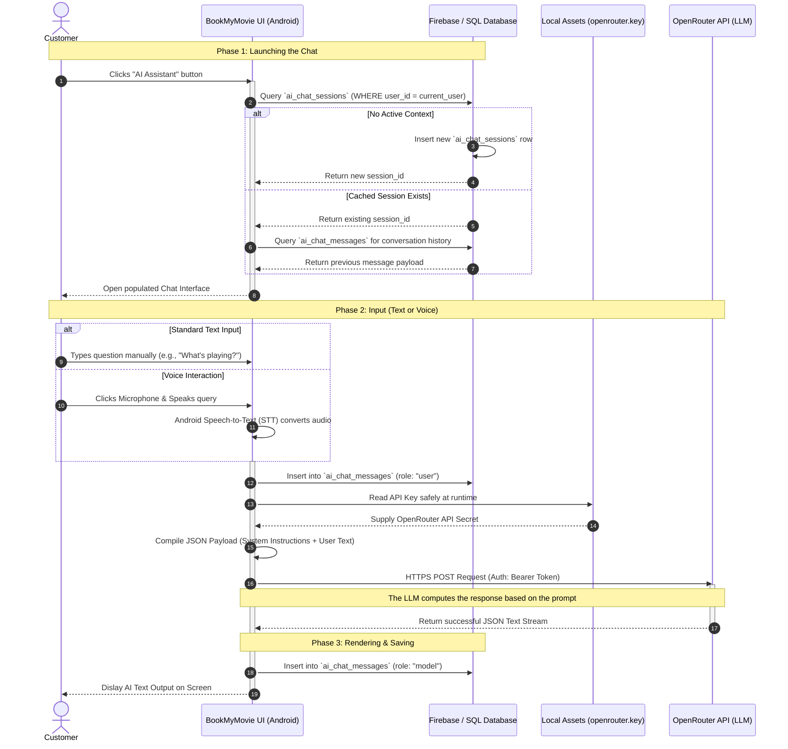

# AI Chatbot Interaction Diagram

Based on the architecture of your BookMyMovie application, this Interaction (Sequence) Diagram documents the exact lifecycle of how a Customer communicates with your Generative AI feature. 

It maps out how the user's input travels from the UI, gets stored in your database tables (`ai_chat_sessions`, `ai_chat_messages`), retrieves your local API key, and successfully connects to the external OpenRouter LLM infrastructure.

## Sequence Diagram

## How this works:
1. **State Persistence**: The communication relies heavily on the `ai_chat_sessions` table. AI models are stateless, meaning they have no memory of the past. To fix this, your app first queries the database to see if the user was talking to the bot previously. If they were, the app rebuilds the context and feeds the whole memory string to the AI before asking the new question.
2. **Local Secrets**: You notice the App does not query the Database for the OpenRouter API Key. Instead, it reads `"openrouter.key"` directly from the hardened local Android binary avoiding unnecessary and insecure network trips.
3. **Dual Writing**: For every single interaction, your backend fires **two** `INSERT` commands into `ai_chat_messages`. First, tagging the customer's question with **role: "user"**, and secondly, capturing the AI's exact response tagged as **role: "model"**. Validating this schema allows you to review historical logs effortlessly.
