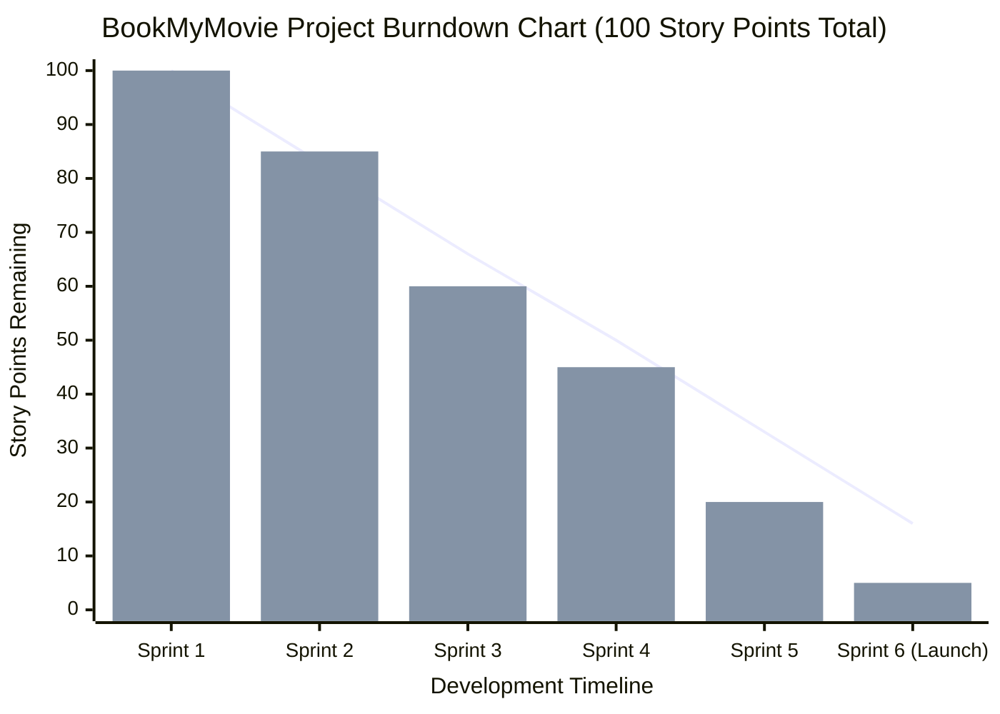

# BookMyMovie Project Burndown Chart

Based on a thorough analysis of all the components mapped in your `database_schema.sql` file (Authentication, Booking Engine, OTT Streaming, Theatre Dashboards, Reviews, and the AI Assistant), I have organized the entire project scope into a 6-Sprint Agile release cycle. 

Below is the **Burndown Chart** (which tracks the amount of work remaining against time) mapped using Mermaid's XY Chart syntax, followed by the breakdown of user stories assigned to each Sprint.

## Agile Burndown Chart

## Sprint & Feature Breakdown
To make the chart above accurate, I analyzed all the tables in your database and grouped them into logical agile development **Sprints** to estimate the work required for each feature set:

### Sprint 1: Identity & Access Management (15 Points)
- Set up Firebase Realtime Database and core architecture.
- **[users]**: Implement Customer Auth, profiles, and preferences.
- **[admin_users]**: Build the super-admin dashboard for overarching control.
- **[theatre_owners]**: Develop the B2B portal for cinema owners to register and await approval.

### Sprint 2: The Cinema Engine (25 Points)
- **[cinemas] & [cinema_photos]**: Build the geographical mapping of theatres (lat/lng, addresses).
- **[cinema_screens] & [seats]**: Implement the highly complex seating algorithms, row maps, and classify the dynamic pricing models (Platinum, Gold, Silver).
- **[movies]**: Populate the central TMDB/Movie catalog repository (Titles, Posters, Durations).

### Sprint 3: Showtimes & Booking Gateway (15 Points)
- **[showtime_requests] & [showtimes]**: Implement the request/approval workflow between Theatre Owners and Admins to push live schedules.
- **[bookings] & [booking_seats]**: Build the core financial engine. Check for seat concurrency, lock seats so double-booking fails, calculate GST and convenience fees.
- Integrate Stripe/Wallet payment listeners to update the `payment_status`.

### Sprint 4: The OTT Streaming Platform (25 Points)
- **[streaming_catalog]**: Build the digital distribution side of the app allowing users to rent/buy exclusive content directly on their phone.
- **[streaming_transactions]**: Handle separate payment intents purely for digital rentals.
- **[user_library]**: Build the logic that checks `expires_at` logic on purchased video streams and generates playback URLs.

### Sprint 5: Social Interactions & Concessions (15 Points)
- **[food_menu] & [booking_food_items]**: Implement the concessions API allowing users to add popcorn/coke to their cart before checking out.
- **[reviews] & [review_tags]**: Build the community feedback system for post-movie ratings.
- **[wishlists] & [wishlist_movies]**: Implement the save-for-later functionality allowing users to track their favorite categorized genres.

### Sprint 6: AI Chatbot & Final Polish (5 Points)
- **[ai_chat_sessions] & [ai_chat_messages]**: Wire up the OpenRouter/Nemotron APIs.
- Save historical session data to allowing users to keep contextual AI chats for movie recommendations.
- Final Application Q&A, bug fixing, and Production Launch.
