# BookMyMovie Class Diagram

Based on the `database_schema.sql` file, below is the formal Class Diagram representing the data models in the system. 

It explicitly includes the data types alongside **Primary Keys [PK]**, **Foreign Keys [FK]**, and has a completely dedicated section for **Database Indexes** inside each class where they belong, so you can clearly see the exact index names from your SQL file!

## Class Diagram

```mermaid
classDiagram
    %% --------------------------------
    %% 1. USERS & ROLES
    %% --------------------------------
    class users {
        +VARCHAR user_id [PK]
        +VARCHAR first_name
        +VARCHAR last_name
        +VARCHAR email [UNIQUE]
        +VARCHAR phone
        +VARCHAR gender
        +VARCHAR dob
        +TEXT address
        +VARCHAR city
        +VARCHAR country_code
        +VARCHAR profile_image_url
        +BIGINT created_at
        %% INDEXES
        +Index idx_users_email(email)
    }

    class admin_users {
        +VARCHAR admin_id [PK]
        +VARCHAR name
        +VARCHAR email [UNIQUE]
        +VARCHAR role
        +BIGINT created_at
    }

    class theatre_owners {
        +VARCHAR owner_uid [PK]
        +VARCHAR name
        +VARCHAR email [UNIQUE]
        +VARCHAR phone
        +VARCHAR cinema_name
        +VARCHAR city
        +VARCHAR place_id
        +VARCHAR status
        +TEXT rejected_reason
        +BIGINT registered_at
        +BIGINT approved_at
        %% INDEXES
        +Index idx_theatre_owners_email(email)
    }

    %% --------------------------------
    %% 2. MOVIES 
    %% --------------------------------
    class movies {
        +VARCHAR movie_id [PK]
        +VARCHAR title
        +TEXT description
        +VARCHAR language
        +VARCHAR genre
        +VARCHAR duration
        +VARCHAR release_date
        +VARCHAR poster_url
        +VARCHAR banner_url
        +VARCHAR rating
        %% INDEXES
        +Index idx_movies_title(title)
    }

    %% --------------------------------
    %% 3. CINEMAS & SCREENS
    %% --------------------------------
    class cinemas {
        +VARCHAR place_id [PK]
        +VARCHAR name
        +TEXT address
        +DOUBLE lat
        +DOUBLE lng
        +DOUBLE rating
    }

    class cinema_photos {
        +SERIAL photo_id [PK]
        +VARCHAR place_id [FK]
        +VARCHAR photo_url
    }

    class cinema_screens {
        +VARCHAR screen_id [PK]
        +VARCHAR place_id [FK]
        +VARCHAR owner_uid [FK]
        +VARCHAR screen_name
        +VARCHAR screen_type
        +INT total_seats
        +INT platinum_seats
        +INT gold_seats
        +INT silver_seats
        %% INDEXES
        +Index idx_cinema_screens_place_id(place_id)
        +Index idx_cinema_screens_owner_uid(owner_uid)
    }

    class seats {
        +VARCHAR seat_id [PK]
        +VARCHAR screen_id [FK]
        +VARCHAR row_char
        +INT col_num
        +VARCHAR seat_type
        +DECIMAL price
        +BOOLEAN is_booked
        +VARCHAR booked_by_uid [FK]
        %% INDEXES
        +Index idx_seats_screen_id(screen_id)
    }

    class food_menu {
        +VARCHAR item_id [PK]
        +VARCHAR cinema_id [FK]
        +VARCHAR name
        +VARCHAR category
        +TEXT description
        +DECIMAL price
        +BOOLEAN available
        +VARCHAR image_url
    }

    %% --------------------------------
    %% 4. SHOWTIMES
    %% --------------------------------
    class showtimes {
        +VARCHAR showtime_id [PK]
        +VARCHAR movie_id [FK]
        +VARCHAR screen_id [FK]
        +VARCHAR date
        +VARCHAR time
        +VARCHAR language
        +DECIMAL platinum_price
        +DECIMAL gold_price
        +DECIMAL silver_price
        %% INDEXES
        +Index idx_showtimes_movie_id(movie_id)
        +Index idx_showtimes_screen_id(screen_id)
    }

    class showtime_requests {
        +VARCHAR request_id [PK]
        +VARCHAR owner_uid [FK]
        +VARCHAR place_id [FK]
        +VARCHAR screen_id [FK]
        +VARCHAR movie_id [FK]
        +VARCHAR date
        +VARCHAR time
        +VARCHAR status
        +TEXT rejected_reason
        +DECIMAL platinum_price
        +DECIMAL gold_price
        +DECIMAL silver_price
        +BIGINT submitted_at
        +BIGINT reviewed_at
        %% INDEXES
        +Index idx_showtime_requests_status(status)
        +Index idx_showtime_requests_owner_uid(owner_uid)
    }

    %% --------------------------------
    %% 5. BOOKINGS & TICKETS
    %% --------------------------------
    class bookings {
        +VARCHAR booking_id [PK]
        +VARCHAR user_id [FK]
        +VARCHAR showtime_id [FK]
        +VARCHAR movie_id [FK]
        +VARCHAR place_id [FK]
        +VARCHAR screen_id [FK]
        +VARCHAR date
        +VARCHAR time
        +VARCHAR status
        +VARCHAR payment_status
        +VARCHAR payment_method
        +VARCHAR payment_intent_id
        +DECIMAL total_amount
        +DECIMAL seat_amount
        +DECIMAL food_amount
        +DECIMAL convenience_fee_amount
        +DECIMAL ticket_gst_amount
        +DECIMAL ticket_gst_rate
        +DECIMAL refundable_amount
        +DECIMAL non_refundable_amount
        +VARCHAR refund_id
        +VARCHAR refund_status
        +TEXT refund_reason
        +BIGINT booked_at
        +BIGINT refunded_at
        %% INDEXES
        +Index idx_bookings_user_id(user_id)
        +Index idx_bookings_showtime_id(showtime_id)
        +Index idx_bookings_movie_id(movie_id)
        +Index idx_bookings_place_id(place_id)
    }

    class booking_seats {
        +SERIAL booking_seat_id [PK]
        +VARCHAR booking_id [FK]
        +VARCHAR seat_number
        +VARCHAR seat_type
    }

    class booking_food_items {
        +SERIAL booking_food_id [PK]
        +VARCHAR booking_id [FK]
        +VARCHAR item_name
        +INT qty
        +DECIMAL price
        +DECIMAL total
    }

    %% --------------------------------
    %% 6. REVIEWS
    %% --------------------------------
    class reviews {
        +VARCHAR review_id [PK]
        +VARCHAR movie_id [FK]
        +VARCHAR user_id [FK]
        +INT rating
        +TEXT content
        +VARCHAR review_date
        +BIGINT timestamp_val
        %% INDEXES
        +Index idx_reviews_movie_id(movie_id)
        +Index idx_reviews_user_id(user_id)
    }

    class review_tags {
        +SERIAL tag_id [PK]
        +VARCHAR review_id [FK]
        +VARCHAR tag_name
    }

    %% --------------------------------
    %% 7. AI CHAT HISTORY
    %% --------------------------------
    class ai_chat_sessions {
        +VARCHAR session_id [PK]
        +VARCHAR user_id [FK]
    }

    class ai_chat_messages {
        +VARCHAR message_id [PK]
        +VARCHAR session_id [FK]
        +VARCHAR role
        +TEXT text_content
        +BIGINT timestamp_val
        %% INDEXES
        +Index idx_ai_chat_messages_session_id(session_id)
    }

    %% --------------------------------
    %% 8. STREAMING CATALOG & TRANSACTIONS
    %% --------------------------------
    class streaming_catalog {
        +VARCHAR movie_id [PK/FK]
        +VARCHAR director
        +TEXT cast_list
        +VARCHAR ott_platform
        +DECIMAL buy_price
        +DECIMAL rent_price
        +INT rent_duration_days
        +BOOLEAN is_active
        +BOOLEAN is_exclusive
        +VARCHAR stream_url
        +VARCHAR trailer_url
        +VARCHAR source
    }

    class streaming_transactions {
        +VARCHAR transaction_id [PK]
        +VARCHAR user_id [FK]
        +VARCHAR movie_id [FK]
        +VARCHAR type
        +DECIMAL amount
        +VARCHAR status
        +VARCHAR payment_intent_id
        +BIGINT timestamp_val
        %% INDEXES
        +Index idx_streaming_tx_user_id(user_id)
    }

    class user_library {
        +VARCHAR library_id [PK]
        +VARCHAR user_id [FK]
        +VARCHAR movie_id [FK]
        +VARCHAR type
        +DECIMAL amount_paid
        +VARCHAR ott_platform
        +BIGINT purchased_at
        +BIGINT expires_at
        +VARCHAR payment_intent_id
        %% INDEXES
        +Index idx_user_library_user_id(user_id)
    }

    %% --------------------------------
    %% 9. WISHLISTS
    %% --------------------------------
    class wishlists {
        +VARCHAR wishlist_id [PK]
        +VARCHAR user_id [FK]
        +VARCHAR name
    }

    class wishlist_movies {
        +VARCHAR wishlist_id [PK/FK]
        +VARCHAR movie_id [PK/FK]
    }

    %% ==========================================
    %% RELATIONSHIPS (Line Definitions)
    %% ==========================================
    
    %% Core Users
    users "1" -- "*" bookings : Places
    users "1" -- "*" reviews : Writes
    users "1" -- "*" wishlists : Owns
    users "1" -- "*" ai_chat_sessions : Starts
    users "1" -- "*" streaming_transactions : Performs
    users "1" -- "*" user_library : Library items
    users "1" -- "0..1" seats : Books (booked_by)

    theatre_owners "1" -- "*" cinema_screens : Manages
    theatre_owners "1" -- "*" showtime_requests : Requests

    %% Cinemas & Screens
    cinemas "1" -- "*" cinema_screens : Contains
    cinemas "1" -- "*" cinema_photos : Has
    cinemas "1" -- "*" food_menu : Offers
    cinema_screens "1" -- "*" seats : Contains layout
    cinema_screens "1" -- "*" showtimes : Screens
    
    %% Movies
    movies "1" -- "*" showtimes : Played in
    movies "1" -- "*" reviews : Has
    movies "1" -- "0..1" streaming_catalog : Linked
    movies "1" -- "*" wishlist_movies : In Wishlist

    %% Showtimes & Booking
    showtimes "1" -- "*" bookings : For
    bookings "1" -- "*" booking_seats : Includes
    bookings "1" -- "*" booking_food_items : Includes
    
    %% Miscellaneous Flow
    ai_chat_sessions "1" -- "*" ai_chat_messages : Contains
    reviews "1" -- "*" review_tags : Has
    wishlists "1" -- "*" wishlist_movies : Contains
```

## How the Database Types are marked
If you hover or view the properties above, the specific tags next to the fields illustrate exact physical database behaviors:
- **`[PK]`**: Primary Key. This is the main unique identifier of the class object.
- **`[FK]`**: Foreign Key. Represents a strict relationship mapped directly back to another table's primary key.
- **`+Index`**: Represents an explicit `CREATE INDEX` query from the bottom of your SQL file to speed up lookups. They are explicitly visible at the bottom of each Class container (e.g., `+Index idx_users_email(email)`).
- **`[UNIQUE]`**: Prevents duplicates from ever being inserted into this class property simultaneously.
