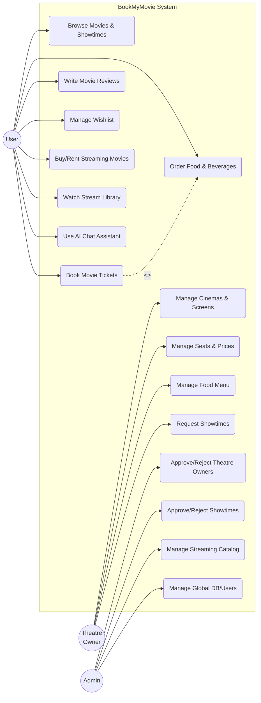

# BookMyMovie Use Case Documentation

Based on the uploaded SQL schema (`database_schema.sql`), three primary actors interact with the BookMyMovie system: **User**, **Theatre Owner**, and **Admin**. Below is the Mermaid use case diagram modeling these interactions, followed by a breakdown of the use cases.

## Use Case Diagram

## Actor & Use Case Analysis

### 1. User
The primary customer interacting with the application.
- **Browse Movies & Showtimes**: Users can search for movies and look at the cinema showtimes (`movies`, `cinemas`, `showtimes`).
- **Book Movie Tickets & Food**: Users select seats, optionally order food, and generate a booking (`bookings`, `booking_seats`, `booking_food_items`).
- **Write Movie Reviews**: Users can rate movies and provide feedback containing tags (`reviews`, `review_tags`).
- **Buy/Rent Streaming Movies**: Users can purchase or rent exclusive OTT content directly via Stripe/Wallet (`streaming_transactions`).
- **Watch Stream Library**: Users maintain a library of purchased digital movies and can watch them before expiry (`user_library`).
- **Manage Wishlist**: Add/Remove movies to custom lists (`wishlists`, `wishlist_movies`).
- **Use AI Chat Assistant**: Uses the conversational AI assistant for recommendations/details (`ai_chat_sessions`, `ai_chat_messages`).

### 2. Theatre Owner
The B2B partner managing the local cinemas.
- **Manage Cinemas & Screens**: Define screen details like 2D/3D and total seats (`cinema_screens`).
- **Manage Seats & Prices**: Classify seats into Platinum, Gold, Silver and set localized pricing (`seats`).
- **Manage Food Menu**: Control snack items offered at their specific cinema branches (`food_menu`).
- **Request Showtimes**: Submit applications to host movies at certain times, which go to the Admin for approval (`showtime_requests`).

### 3. Admin / System Admin
The internal staff managing the core platform integrity.
- **Approve/Reject Theatre Owners**: Verify theatre owners submitting registration requests (`theatre_owners.status`).
- **Approve/Reject Showtimes**: Review the `showtime_requests` from Theatre Owners and map them to live `showtimes`.
- **Manage Streaming Catalog**: Add/Update digital movies into the streaming pool, setting rent durations and prices (`streaming_catalog`).
- **Manage Global DB/Users**: Complete oversight of all users, genres, and movie master data (`admin_users`, `movies`).
