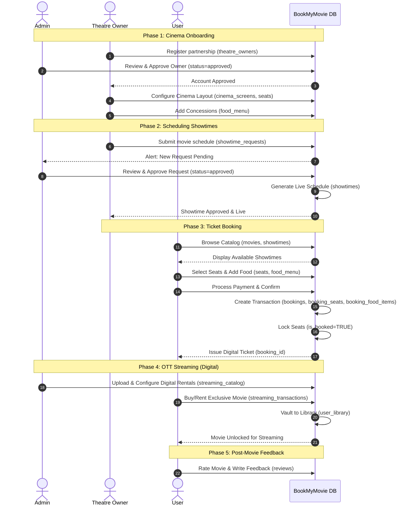

# System Interaction Diagram: 3-Actor Workflow

Based on the `database_schema.sql` file, this Sequence Diagram illustrates the complete end-to-end lifecycle of the system. It shows how the **Admin**, **Theatre Owner**, and **User** all interact with the BookMyMovie databases to create, approve, and consume content.

## Sequence Diagram

## Diagram Breakdown

This interaction maps out how the three actors rely on each other to make the application function:

1. **Phase 1: Cinema Onboarding**: The **Theatre Owner** registers their cinema with the system. The **Admin** must verify and formally approve the `theatre_owner` record before the owner can configure their `cinema_screens` and layout the `seats`.
2. **Phase 2: Scheduling Showtimes**: Theatre owners cannot magically create tickets. They must submit a `showtime_request` to the database. The **Admin** acts as the gatekeeper, approving the request to generate the official `showtimes` row that customers can actually see.
3. **Phase 3: Ticket Booking**: The core **User** enters the flow. They browse the approved showtimes, reserve seats, and order food. Their payment inserts records into `bookings` and locks the rows inside the `seats` table so no one else can book them.
4. **Phase 4: OTT Streaming (Digital)**: Completely separate from the local cinemas, the **Admin** manages purely digital content inside the `streaming_catalog`. The **User** can directly rent this content, dropping it directly into their `user_library`.
5. **Phase 5: Post-Movie Feedback**: The **User** interacts with the `reviews` table, leaving ratings that can be seen system-wide.
